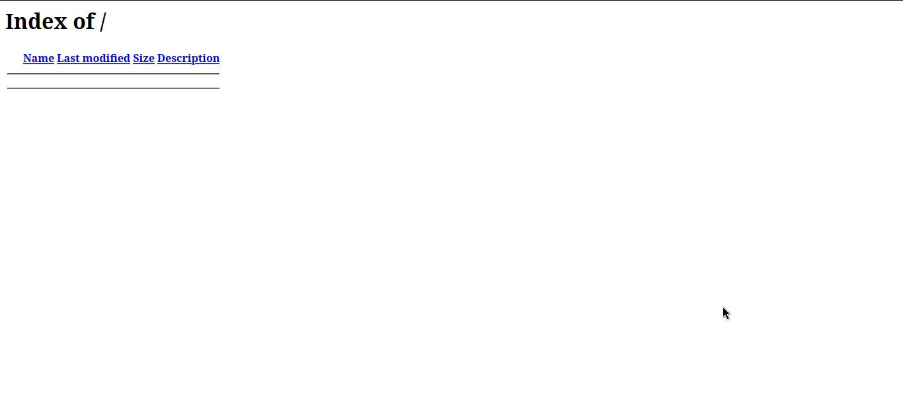
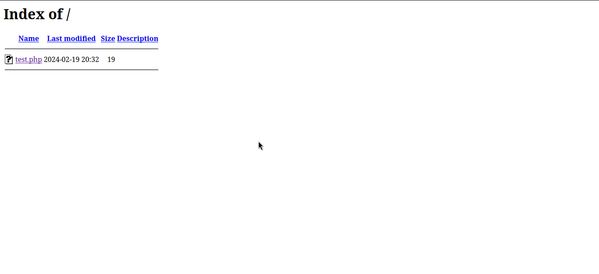
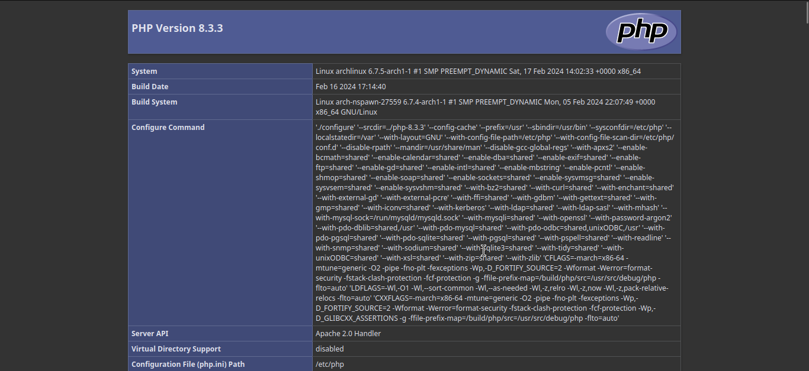
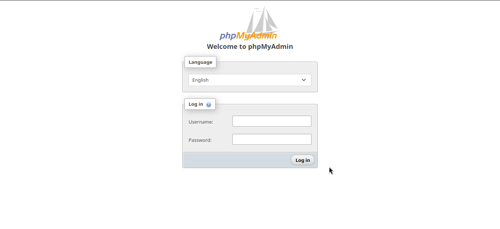

### Arch va Arch Based Distrolarda apacheni localhost sifatida ishlatish


Kerakli paketlar: ``gedit``, ``phpmyadmin``, ``apache``, ``php-apache``, ``mariadb``


## Apache, PHP o'rnatish va sozlash.
* Apacheni tizimga o'rnatish

    ```sudo pacman -S apache php php-apache```

* Apacheni ishga tushirish:

  * Buning uchun quyidagi buyruqlarni ishga tushuring
  
        sudo systemctl enable httpd
        sudo systemctl start httpd

* Apache ishga tushganini sinab ko'rish:

     Buning uchun istalgan brauzerda http://localhost/ urlga so'rov jo'nating.
    
     

    va siz yuqoridagidek holatga duch kelasiz.

* Kerakli sozlamalar

    ```sudo gedit /etc/httpd/conf/httpd.conf```

    buqug'ini ishga tushuring va ochilgan faylda quyidagilarni amalga oshiring!

    ``LoadModule mpm_event_module modules/mod_mpm_event.so``

    qatorini kommenga oling ```(oldiga # qo'yish orqali)``` va

    ``LoadModule mpm_prefork_module modules/mod_mpm_prefork.so``

    qatorini kommentdan chiqaring (oldidan # olib tashlash orqali)

    Tabriklaymiz siz apacheni ishga tushurdingiz


    
## Apache uchun PHP sozlash
* Terminalda quyidagi buyruqni ishga tushuring

    ```sudo gedit /etc/httpd/conf/httpd.conf```

    va ochilgan oynani eng pastki qismiga

  ``` LoadModule php_module modules/libphp.so ```
   
  ``` AddHandler php-script .php ```
   
  ``` Include conf/extra/php_module.conf ```
  
  qatorlarini yozing


* Faylni saqlab serverni qayta ishga tushuring

    Buning uchun quydagi buyruqni terminlda ishga tushuring
        
    ```sudo systemctl restart httpd```


## PHP o'rnatilganini tekshirish (Ixtiyoriy)
* Apache uchun root folder ``/var/http/`` folderida joylashgan bo'ladi. va biz bu folderda fayl yaratish uchun avval quyidagi buyqurni amalga oshirishimiz kerak

    ```sudo chown -R <username>:<username> /var/http ```

    ``<username>`` qismini o'zingizni login foydalanuvchi nomi bilan almashtiring

    bu buyruq, ``/var/httpd/`` folderni ``<username>`` nomli foydalanuvchiga o'tkazadi
* Test php page yaratamiz

    ``/var/http/`` folderda ```nano test.php``` buyrug'ini amalga oshiring

    bu buyruq ``test.php`` faylini yaratadi
    
    ochilgan oynaga quyadagi kodni kiriting va saqlang:
  
      <?php phpinfo(); ?>

* Browserda tekshirish
    
    ``http://localhost/`` urlga so'rov yuboring va quyidagi holatni ko'rasiz:
    
     
  
    ``test.php`` fileni ochamiz va u bizga quyidagi pageni ko'rsatadi
    
    

    Tabriklayman sizda apache va apache uchun php o'rnatildi

## Database o'rnatish va sozlash

* ### Database uchun ``mariadb``dan foydalanamiz
  
  O'rnatish uchun quyidagi buyruqni ishga tushuring 
      
  ``sudo pacman -S mariadb``
  
  o'rnatib bo'lgandan so'ng quyidagi buyqurlarni ketma ketlikda bajaring
  
  ```sudo mariadb-install-db --user=mysql --basedir=/usr --datadir=/var/lib/mysql```
  
  ```sudo systemctl enable mariadb```

  ```sudo systemctl start mariadb```
  
  Ishga tushgan ekanligini tekshirish
  
  ``sudo systemctl status mariadb``

* ### Database uchun root parolini o'zgartiramiz
  
  Buning uchun quyidagilarni ketma-ketlikda bajaring!

  ``sudo systemctl stop mariadb``

  ``sudo mariadbd-safe --skip-grant-tables --skip-networking &``

  ``mariadb -u root``
  
  ``FLUSH PRIVILEGES;``

  ``ALTER USER 'root'@'localhost' IDENTIFIED BY 'new_password';``

  ```new_passwor``` bu root uchun parol

  ``exit``

* Security o'rnatish

  Buning uchun quyidagi buyruqni ishga tushuring

  ``sudo mariadb-secure-installation``

  Barcha savollar uchun ``y`` yoki ``enter`` bosiladi


## PHPMyadmin o'rnatish

  Buning uchun quyidagi buyquni bajaring
  
  ``sudo pacman -S phpmyadmin``

  O'rnatib bo'lgandan so'ng quyidagilarni ketma ketlikda bajaring

  ``sudo gedit /etc/httpd/conf/extra/phpmyadmin.conf``

  yaratilgan bo'sh faylga quyidagilarni yozing
  
  ```
    Alias /phpmyadmin "/usr/share/webapps/phpMyAdmin"
    <Directory "/usr/share/webapps/phpMyAdmin">
        DirectoryIndex index.php
        AllowOverride All
        Options FollowSymlinks
        Require all granted
    </Directory>
  ```
  
  faylni saqlang va quyidagi buyqurni bajaring

  ```sudo gedit /etc/httpd/conf/httpd.conf```

  va faylni eng pastki qismiga quyidagilarni yozing

  ```
    # phpMyAdmin configuration
    Include conf/extra/phpmyadmin.conf
  ```
  
  Tabriklaman sizda phpmyadmin sozlandi!

## PHP ini faylini sozlash

  Buning uchun quyidagi ishlarni bajaring

  ```sudo gedit /etc/php/php.ini```

  ochilgan faylda quyidagi extensionlarni komentdan chiqaring ```(qator oldidan ; belgisini olib tashlash orqali)```
  
  ``mysqli``, ```pdo_mysql```, ```iconv```
  
  faylni saqlang va serverni qayta ishga tushuring
  buning uchun quyidagi buyruq bajariladi
  
  ```sudo systemctl restart httpd```
  
* PHPMyadminni test qilish
  ``http://localhost/phpmyadmin`` havolasiga so'rov yuboring va u quyidagi ko'rinishni beradi
    
  

  username: root

  parol: ``<siz_yozgan_root_parol>``