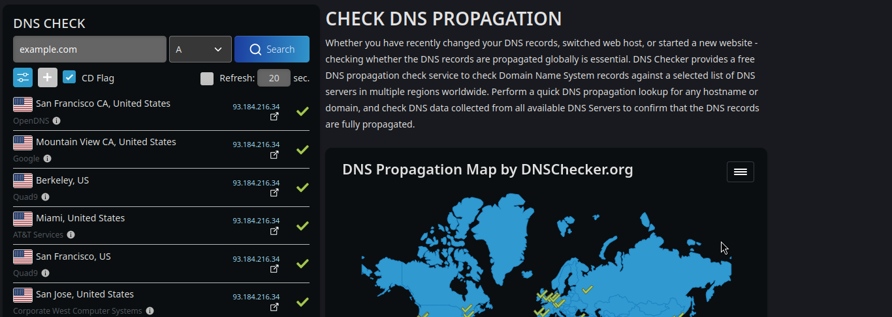
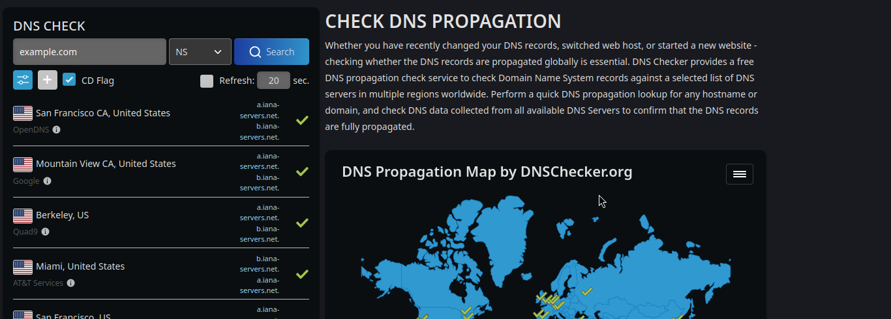
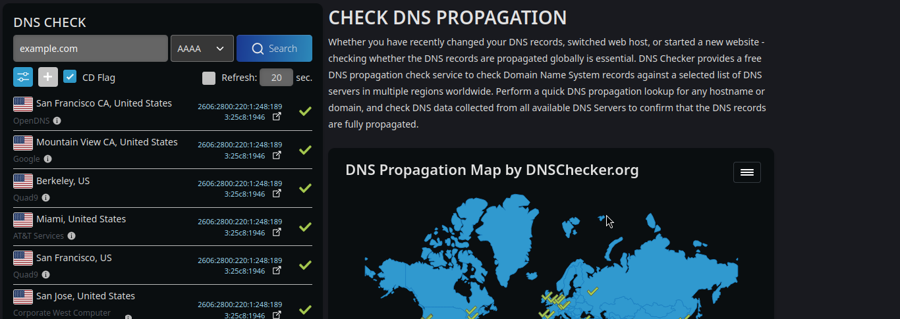

### Bu maqolada siz bilan ```bind9```orqali VPSda DNS nameserver(```ns1.domain.uz```,```ns2.domain.uz```) qanday sozlanishi haqida qisqacha ko'rib chiqamiz.

## 0. DNS serverni sozlashdan oldin
### Kerakli narsalar:
- VPS
- Domen nomi
- IP manzil (VPS provider tomonidan berilgan public IP)
- IPv6 manzil (Agar VPS provider tomonidan berilgan bo'lsa)
- Linux terminalida ishlash qobiliyati 
### 1. O'rnatish
```bash
apt update && apt install bind9 -y
```
- sozlashni asosan 3 ta faylda olib boramiz! 
- ```Iltimos fayllarni ko'rsatilgan ma'lumotlar bilan birxil holatda o'zgartiring! Xattoki bir nutqa o'zgarishi ham configuratsiya ishlamay qolishiga olib kelishi mumkin```

1.1 ```bind9```ni ishlga tushirish
```bash
systemctl start bind9
```
1.2 ```bind9```ni avtomatik ishga tushirishni yoqish
```bash
systemctl enable bind9
```

### 2. named.conf.local fayilini o'zgartirish
```bash
nano /etc/bind/named.conf.local
```
- ochilgan ```named.conf.local``` faylini quyidagi holatda o'zgartiramiz:
```bash
//
// Do any local configuration here
//

// Consider adding the 1918 zones here, if they are not used in your
// organization
//include "/etc/bind/zones.rfc1918";

zone "your-domain.uz" {
	type master;
	file "/var/lib/bind/your-domain.uz.hosts";
};
```
#### Bu yerda ```your-domain.uz``` uchun o'zingizning domen nomeringizni yozasiz.
#### !!! Har qanday yangi domen uchun yangi ```zone``` qo'shishingiz kerak bo'ladi.
- Misol uchun:
```bash
zone "your-second-domain.uz" {
	type master;
	file "/var/lib/bind/your-domain.uz.hosts";
};
```
- Eslatma! bu yerda ```file "/var/lib/bind/your-domain.uz.hosts";``` qismi o'zgarishsiz qoladi.

### 3. named.conf.options fayilini o'zgartirish
```bash
nano /etc/bind/named.conf.options
```
- ochilgan ```named.conf.options``` faylini quyidagi holatda o'zgartiramiz:
```bash
options {
    directory "/var/cache/bind";

    // If there is a firewall between you and nameservers you want
    // to talk to, you may need to fix the firewall to allow multiple
    // ports to talk.  See http://www.kb.cert.org/vuls/id/800113

    // If your ISP provided one or more IP addresses for stable 
    // nameservers, you probably want to use them as forwarders.  
    // Uncomment the following block, and insert the addresses replacing 
    // the all-0's placeholder.

    forwarders {
        8.8.8.8;
    	8.8.4.4; 
    };
	forward only;
    //========================================================================
    // If BIND logs error messages about the root key being expired,
    // you will need to update your keys.  See https://www.isc.org/bind-keys
    //========================================================================
    dnssec-validation auto;
	allow-query { any; };
    listen-on-v6 { any; };
	recursion yes;

};
```
- ```forwarders``` qismida sizning ```DNS``` serverlaringizni yozasiz.
- ```allow-query { any; };``` qismida sizning ```DNS``` serveringizga qaysi ```IP```lardan so'rovlar qabul qilishini yozasiz.
- ```listen-on-v6 { any; };``` qismida ```IPv6```ni qo'llashni yozasiz.
- Agar sizda ```IPv6``` yo'q bo'lsa ```listen-on-v6 { any; };``` qismi o'chiriladi.
o'zgarishlarni saqlab editordan chiqamiz.

### 4. Domen nomerimiz uchun fayl yaratish
```bash
nano /var/lib/bind/your-domain.uz.hosts
```
- ochilgan ```your-domain.uz.hosts``` fayliga quyidagi ma'lumotlarni yozamiz:
```bash
$ttl 3600
@	IN	SOA	<your-vps-ip>. <your-email>. (
			2024030908
			3600
			600
			1209600
			3600 )
	IN	NS	ns1.domain-name.uz.
	IN	NS	ns2.domain-name.uz
	IN	AAAA	<your-ipv6>
	IN	A	<your-vps-ip>
*	IN	A	<your-vps-ip>
*	IN	AAAA	<your-ipv6>
```
- ```<your-vps-ip>``` - VPSingizning IP manzili
- ```<your-email>``` - Sizning email manzilingiz
- ```<your-ipv6>``` - VPSingizning IPv6 manzili
- ```domain-name.uz``` - Sizning domen nomeringiz
- ```ns1.domain-name.uz``` - Sizning birinchi nameserveringiz
- ```ns2.domain-name.uz``` - Sizning ikkinchi nameserveringiz
- Agar sizda ```IPv6``` yo'q bo'lsa ```AAAA``` qismi o'chiriladi.

// Bu configuration hamma domain nomlari uchun amal qiladi! Ya'ni siz ```named.conf.local``` faylida qo'shganingizdek har bir ```zone``` uchun yangi  ```your-domain.uz.hosts``` faylini yaratishingiz kerak emas.


### 5. DNS serverni qayta ishga tushiramiz
```bash
systemctl restart bind9
```
- Agar barcha sozlamalar to'g'ri qilinsa, sizning DNS serveringiz ishga tushiriladi.
``bind9`` serveringizni tekshirish uchun quyidagi komandalarni ishga tushirishingiz mumkin:
```bash
systemctl status bind9
```
Agar biror xatolik yuzaga kelsa, iltimos configuration fayllarni tekshirib ko'ring va ```bind9```ni qayta ishlga tushiring.

### 6. Domain uchun o'zingiz yaratgan nameserverlarni yozish
- Domain provideringizga kirib, domain nomeringiz uchun o'zingiz yaratgan nameserverlarni yozasiz.
- ```ns1.domain-name.uz``` - Sizning birinchi nameserveringiz
- ```ns2.domain-name.uz``` - Sizning ikkinchi nameserveringiz
Barcha sozlamalarni bajarganingizdan so'ng kutishingiz kerak bo'ladi. Nameserver almashish vaqi 24 soatgacha cho'zilishi mumkin. DNS serveringizni ishlayotganini tekshirish uchun https://dnschecker.org/ saytiga tashrif buyuring va o'z domeningiz uchun A/NS/AAAA DNS recordlarini qidiring va u quyidagicha ma'lumotni ko'rsatishi kerak:








PS: domain uchun nameserver almashtirgangan so'ng, nginx/apache serevrlarini domain uchun sozlashni unutmang:) 


### Tabriklaymiz siz ```bind9``` orqali VPSda DNS serveringizni sozladingiz! Biror muammo bo'lsa, [WebFoxUZ](https://t.me/webfoxuz/) kanal muhokamasida savol berishingiz mumkin.